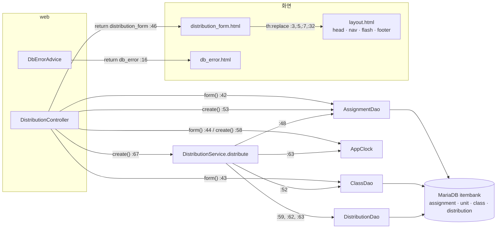

# 과제 배포 (legacy/assignment-thymeleaf) 아키텍처 — "새 배포" 화면

## 범위

- **대상**: "새 배포" 화면 `distribution_form.html` 하나와 그 화면이 부르는 코드.
  - `GET /distributions/new` (폼 표시) · `POST /distributions` (폼 제출 = 배포 등록)
- **범위 밖** (이름만 적고 분석하지 않음)
  - `GET /distributions` 배포 목록 (`DistributionController.java:32-38`) — 등록 성공 시 redirect 대상으로만 등장
  - `POST /distributions/{id}/redistribute` 재배포 (`DistributionController.java:79-100`, `DistributionService.java:70-701`)
  - `AssignmentController` · `assignments.html` (과제 목록)
  - `DistributionRow` · `SubmissionRow` · `RedistributeResult`, `DistributionDao` 의 `findAllForList` · `findById` · `markRedistributed` · `findSubmissions`
- 분석 방법: 코드 읽기 + MariaDB `readonly` 계정 조회. 앱(compose `thymeleaf` 프로필)은 실행하지 않았다.

## 모듈 개요

- Spring Boot 3.3.4 · Java 17 · Spring MVC + Thymeleaf + `JdbcTemplate` (`build.gradle:3`, `:11-12`, `:25-28`). JPA 없음.
- 계층: `web/*Controller` → `service/DistributionService` → `dao/*Dao`(`JdbcTemplate`) → MariaDB `itembank`.
  - 단, `DistributionController` 는 Service 외에 `AssignmentDao` · `ClassDao` 도 직접 주입받아 부른다 (`DistributionController.java:22-30`).
- 현재 시각은 `AppClock.now()` 한 곳에서 구한다. **기본값이 `2026-09-15 00:00:00` 고정**이고 `-Dapp.clock=system` 일 때만 실제 시각이다 (`AppClock.java:8-9`, `:14-19`). `Dockerfile:11` ENTRYPOINT 와 `docker-compose.yml` 의 `assignment` 서비스 어디에도 `app.clock` 설정이 없다.
- 화면 하단 버전 표기 `v1.4.2` (`layout.html:35`), `build.gradle:8` `version = '1.4.2'`.

## 관련 파일

```
legacy/assignment-thymeleaf/src/main/
├── java/com/example/assign/
│   ├── AppClock.java                     28줄  now() 고정 시각 · fmt()
│   ├── web/DistributionController.java  101줄  form() · create()   (list · redistribute 는 범위 밖)
│   ├── web/DbErrorAdvice.java            18줄  DataAccessException → db_error 화면
│   ├── service/DistributionService.java 701줄  distribute() 46-68 만 범위
│   ├── dao/AssignmentDao.java            66줄  findAllForSelect · findById
│   ├── dao/ClassDao.java                 42줄  findAll · findById
│   ├── dao/DistributionDao.java         108줄  countByAssignmentAndClass · nextId · insert
│   └── model/AssignmentRow.java · ClassRow.java
└── resources/
    ├── application.properties            14줄
    └── templates/distribution_form.html · layout.html · db_error.html
```

## 1. 진입점 표

| # | URL · 메서드 | 핸들러 (파일:줄) | 파라미터 | 결과 |
|---|---|---|---|---|
| E1 | `GET /distributions/new` | `DistributionController.form(Model)` — `DistributionController.java:40-47` | 없음 | 뷰 `distribution_form`. 모델: `assignments` · `classes` · `now` · `menu="new"` (`:42-45`) |
| E2 | `POST /distributions` | `DistributionController.create(long, long, RedirectAttributes)` — `DistributionController.java:49-77` | `assignmentId` (`@RequestParam long`, 필수) `:50`, `classId` (`@RequestParam long`, 필수) `:51` | 성공: flash `message` + `redirect:/distributions` (`:68`, `:76`). 실패: flash `error` + `redirect:/distributions/new` (`:55-56`, `:62-63`, `:70-71`, `:73-74`) |
| E3 | (예외 처리) `DataAccessException` | `DbErrorAdvice.dbError` — `DbErrorAdvice.java:11-17` | — | 뷰 `db_error` (`:16`). E1 전체와 E2 의 `assignmentDao.findById`(`DistributionController.java:53`, try 밖)가 여기로 온다 |

- 화면 진입 링크: 공통 메뉴 `layout.html:26` `<a th:href="@{/distributions/new}">새 배포</a>`.
- 폼 제출: `distribution_form.html:8` `<form method="post" th:action="@{/distributions}">`, 입력 이름 `assignmentId` (`:11`) · `classId` (`:23`).
- 결과 메시지 표시: `RedirectAttributes.addFlashAttribute` → redirect → `layout :: flash` 조각 (`layout.html:28-34`, `distribution_form.html:7`).

## 2. 의존 관계 (호출하는 쪽 → 불리는 쪽)



### 호출 목록

| 호출하는 쪽 (파일:줄) | → 불리는 쪽 | 비고 |
|---|---|---|
| `DistributionController.java:42` | `AssignmentDao.findAllForSelect()` (`AssignmentDao.java:34-39`) | 과제 드롭다운 |
| `DistributionController.java:43` | `ClassDao.findAll()` (`ClassDao.java:20-22`) | 학급 드롭다운 |
| `DistributionController.java:44`, `:58` | `AppClock.now()` (`AppClock.java:14-20`) | 화면 `now` · 마감 비교 기준 |
| `DistributionController.java:53` | `AssignmentDao.findById(long)` (`AssignmentDao.java:41-48`) | try 밖 |
| `DistributionController.java:62` | `AppClock.fmt(LocalDateTime)` (`AppClock.java:22-27`) | 오류 문구의 마감 시각 |
| `DistributionController.java:67` | `DistributionService.distribute(long, long)` (`DistributionService.java:46-68`) | try 안 |
| `DistributionService.java:48` | `AssignmentDao.findById(long)` | 컨트롤러와 같은 조회를 한 번 더 한다 |
| `DistributionService.java:52` | `ClassDao.findById(long)` (`ClassDao.java:24-30`) | |
| `DistributionService.java:59` | `DistributionDao.countByAssignmentAndClass(long, long)` (`DistributionDao.java:47-52`) | |
| `DistributionService.java:62` | `DistributionDao.nextId()` (`DistributionDao.java:54-57`) | |
| `DistributionService.java:63` | `DistributionDao.insert(long, long, long, LocalDateTime)` (`DistributionDao.java:59-63`) · `AppClock.now()` | |
| `distribution_form.html:3`, `:5`, `:7`, `:32` | `layout.html` 의 `head` · `nav` · `flash` · `footer` 조각 (`layout.html:3`, `:23`, `:28`, `:35`) | |
| (Spring MVC) `DataAccessException` 전파 | `DbErrorAdvice.dbError` (`DbErrorAdvice.java:11-17`) → `db_error.html` | `System.out.println` 으로 기록 (`:13`) |

### 외부 라이브러리

| 라이브러리 | 쓰는 곳 |
|---|---|
| `spring-boot-starter-web` (Spring MVC, `RedirectAttributes`, `@ControllerAdvice`) | `build.gradle:25`, 컨트롤러 전체 |
| `spring-boot-starter-thymeleaf` (`#temporals`, `th:replace`) | `build.gradle:26`, `distribution_form.html:17` |
| `spring-boot-starter-jdbc` (`JdbcTemplate`, `@Transactional`) | `build.gradle:27`, DAO 전체 · `DistributionService.java:46` |
| `mariadb-java-client` | `build.gradle:28`, `application.properties:2`, `:5` |

### DB 객체

| DB 객체 | 종류 | 읽기/쓰기 | 쓰는 곳 |
|---|---|---|---|
| `assignment` | 테이블 | 읽기 | `AssignmentDao.java:21-24` (BASE_SELECT) |
| `unit` | 테이블 | 읽기 (`LEFT JOIN`) | `AssignmentDao.java:24` |
| `distribution` | 테이블 | 읽기 · **쓰기(INSERT)** | 서브쿼리 `AssignmentDao.java:23`, `DistributionDao.java:49`, `:55`, `:61` |
| `class` | 테이블 | 읽기 | `ClassDao.java:21`, `:25` |

- 이 경로는 **뷰 · 프로시저를 참조하지 않는다** (`v_item_public` 는 문항 은행 전용, `01-schema.sql:52-70`).
- `submission` 은 `DistributionDao.BASE_SELECT`(`DistributionDao.java:23-29`)에만 나오고, 이 경로는 그 SELECT 를 실행하지 않는다 → 범위 밖.

### 이관 시 참고 (관찰)

- 컨트롤러가 DAO 를 직접 부른다 (`DistributionController.java:23-24`, `:42-43`, `:53`). 현행 API 컨벤션(Controller 는 Service 만 주입)과 다르다.
- 컨트롤러에 `try`/`catch` 가 있다 (`DistributionController.java:66-75`).
- DB 접속 기본 계정이 쓰기 계정이다 (`application.properties:3-4`, compose 도 같은 계정 주입). 문서 작업에서는 이 계정을 쓰지 않았다.

### 미확인 목록

| 항목 | 이유 |
|---|---|
| 과제 상태 `X`(연장) · `D`(삭제)가 어디서 설정되는지 | 코드는 두 값을 비교하지만 (`DistributionController.java:61`, `DistributionService.java:56`) 스키마 주석은 `O` · `C` 만 정의하고 (`01-schema.sql:87`), 시드와 현재 DB 에 두 값이 없다 (readonly 조회). 상태를 바꾸는 코드는 범위 안에 없다 |
| JVM 기본 시간대 | `Timestamp.valueOf(LocalDateTime)` (`DistributionDao.java:62`) · `rs.getTimestamp` (`AssignmentDao.java:59-60`) 는 JVM 기본 시간대를 쓴다. 컨테이너 TZ 설정은 확인하지 않았다 |
| 운영 환경에서 `app.clock=system` 을 주는지 | 저장소 안(Dockerfile · compose)에는 없다. 그 밖의 배포 설정은 저장소에 없다 |
| 잘못된 파라미터(`abc` · 빈 값) 요청의 실제 응답 | Spring 기본 변환에 맡겨져 있고 앱을 실행하지 않았다 (BUSINESS-RULES BR-14) |
