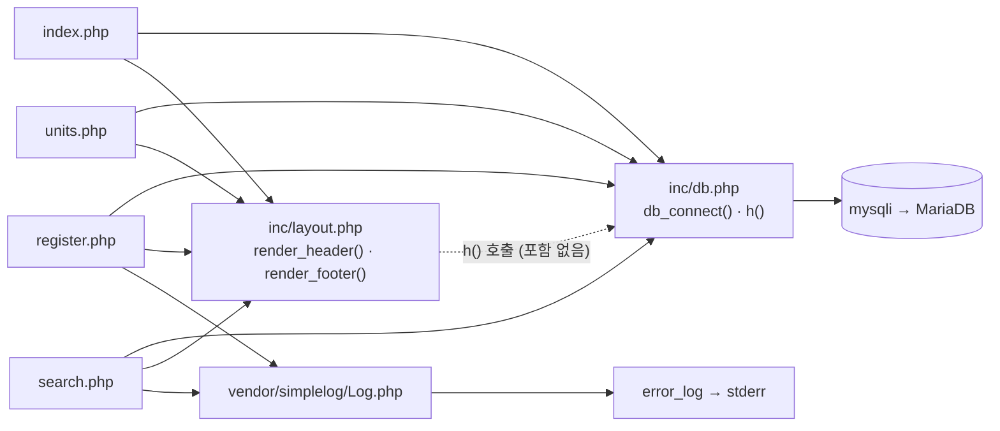

# 문항 은행 (legacy/item-bank-php) 아키텍처

## 모듈 개요

- PHP 7.4 + Apache 이미지에서 mysqli 로 MariaDB 에 붙는 문항 은행 화면이다 (`Dockerfile:1-3`).
- 라우터가 없고 루트의 PHP 파일 하나가 URL 하나에 대응한다 (`Dockerfile:14`, `index.php:9-11`).
- 화면은 홈 · 단원 목록 · 문항 등록 · 문항 검색 4개다.
- 공통 코드는 `inc/db.php`(DB 연결 · 이스케이프)와 `inc/layout.php`(머리말 · 꼬리말), 로깅은 `vendor/simplelog/Log.php` 다.
- 전체 약 1,120줄이고 그중 `search.php` 가 731줄이다.

## 폴더 구조

```
legacy/item-bank-php/
├── Dockerfile                  16줄   php:7.4-apache, mysqli 설치, 소스를 /var/www/html 로 복사
├── index.php                   14줄   홈(메뉴)
├── units.php                   48줄   단원 목록
├── register.php               177줄   문항 등록
├── search.php                 731줄   문항 검색
├── inc/
│   ├── db.php                  37줄   db_connect(), h()
│   └── layout.php              43줄   render_header(), render_footer()
└── vendor/simplelog/
    └── Log.php                 54줄   외부 라이브러리(더미), error_log 로만 기록
```

## 진입점 표

| URL / 화면 | 처음 실행되는 파일 | 주요 호출 (근거) |
|---|---|---|
| `/`, `/index.php` 홈(메뉴) | `index.php` | `render_header('홈')` (`index.php:5`), `render_footer()` (`index.php:14`). DB 조회 없음 |
| `/units.php` 단원 목록 | `units.php` | `render_header` (`units.php:5`), `db_connect` (`units.php:8`), `$conn->query` 단원별 공개 문항 수 (`units.php:16-20`), `h` (`units.php:40-43`), `render_footer` (`units.php:48`) |
| `/register.php` 문항 등록 (GET: 폼, POST: 저장) | `register.php` | `db_connect` (`register.php:17`), 단원 · 태그 목록 조회 (`register.php:27`, `:34`), POST 검증 (`register.php:40-81`), `begin_transaction` · `prepare` · `commit` · `rollback` (`register.php:85-120`), `Log::info` / `Log::error` (`register.php:115`, `:121`), `render_header` / `render_footer` (`register.php:127`, `:177`) |
| `/search.php` 문항 검색 (GET `q, unit, level, tag, sort, dir, page` — `search.php:5-12`) | `search.php` | `Log::setThreshold` (`search.php:27`), `render_header` (`search.php:709`), `db_connect` (`search.php:713`), `buildSearchQuery($_GET, $conn)` (`search.php:722`), `renderSearchForm` (`search.php:723`), `runSearchQuery` (`search.php:724`), `renderResultTable` (`search.php:725`), `render_footer` (`search.php:731`) |

- `a2enmod rewrite` 는 켜져 있지만(`Dockerfile:4`) 모듈 폴더에 `.htaccess` 가 없다. 모듈 안에 URL 재작성 규칙은 없다.

## 의존 관계



표기는 "A → B (A 가 B 를 포함하거나 호출)" 다. 점선은 `require` 없이 함수만 부르는 관계다.

### 파일 포함 (`require_once`)

| A → B | 근거 |
|---|---|
| `index.php` → `inc/db.php`, `inc/layout.php` | `index.php:2-3` |
| `units.php` → `inc/db.php`, `inc/layout.php` | `units.php:2-3` |
| `register.php` → `inc/db.php`, `inc/layout.php`, `vendor/simplelog/Log.php` | `register.php:2-4` |
| `search.php` → `inc/db.php`, `inc/layout.php`, `vendor/simplelog/Log.php` | `search.php:20-22` |

`inc/db.php`, `inc/layout.php`, `vendor/simplelog/Log.php` 는 다른 파일을 포함하지 않는다.

### 함수 호출

| A → B | 근거 |
|---|---|
| 모든 화면 → `render_header()` / `render_footer()` | 정의 `inc/layout.php:7`, `:38` |
| `units.php`, `register.php`, `search.php` → `db_connect()` | 정의 `inc/db.php:7` / 호출 `units.php:8`, `register.php:17`, `search.php:713` |
| `inc/layout.php` → `h()` | `inc/layout.php:17`, `:33` (정의 `inc/db.php:34`) |
| `units.php`, `register.php`, `search.php` → `h()` | 예: `units.php:40`, `register.php:131`, `search.php:360` |
| `register.php` → `Log::info` / `Log::error` | `register.php:115`, `:121` |
| `search.php` → `Log::setThreshold` / `Log::debug` / `Log::error` | `search.php:27`, `:103`, `:528`, `:537`, `:727` |
| `Log::*` → PHP `error_log()` → stderr | `vendor/simplelog/Log.php:52`, `Dockerfile:11` |
| `db_connect()` → mysqli 확장 | `inc/db.php:21`, `Dockerfile:3` |
| `search.php` 실행부 → `buildSearchQuery` → `runSearchQuery` → `renderResultTable` (폼은 `renderSearchForm`) | `search.php:722-725` |

- `inc/layout.php` 는 `inc/db.php` 를 포함하지 않지만 `h()` 를 호출한다. 각 화면이 `db.php` 를 먼저 포함해야 동작하는 암묵적 순서 의존이다.

### DB 객체 참조

| 파일 → 테이블 · 뷰 | 근거 |
|---|---|
| `units.php` → `unit`, `item` | `units.php:16-18` |
| `register.php` → `unit`, `tag` (읽기) | `register.php:27`, `:34` |
| `register.php` → `item`, `item_tag` (쓰기) | `register.php:87`, `:93`, `:105` |
| `search.php` → `unit`, `tag` | `search.php:125`, `:156`, `:178` |
| `search.php` → `item_tag` | `search.php:244` |
| `search.php` → 뷰 `v_item_public` | `search.php:522` |

## 가장 긴 함수 3개

| 순위 | 파일 | 함수 | 라인 | 줄 수 | 하는 일 |
|---|---|---|---|---|---|
| 1 | `search.php` | `buildSearchQuery` | 42–564 | 523 | GET 파라미터로 WHERE · ORDER BY · LIMIT SQL, 바인딩 값, 폼 · 요약 · 경고 HTML, 정렬 · 페이지 링크를 한꺼번에 만든다. 선택 목록을 위해 DB 도 직접 조회한다 (`search.php:125`, `:156`, `:178`) |
| 2 | `search.php` | `renderResultTable` | 647–704 | 58 | 경고 · 조건 요약 · 건수 · 결과 표 · 페이지 링크를 출력한다 |
| 3 | `search.php` | `runSearchQuery` | 571–624 | 54 | 건수 조회와 페이지 조회 SQL 을 각각 prepare · bind · execute 해 `total` 과 `rows` 를 돌려준다 |

그 밖의 함수는 모두 30줄 이하다: `render_header` (`inc/layout.php:7-36`), `db_connect` (`inc/db.php:7-29`), `renderSearchForm` (`search.php:629-641`), `Log::write` (`vendor/simplelog/Log.php:43-53`).

## 미확인 목록

| 항목 | 현재 알고 있는 것 | 확인할 곳 |
|---|---|---|
| `/` 요청이 `index.php` 로 가는지 | `php:7.4-apache` 이미지의 기본 DirectoryIndex 에 의존. 저장소 안에 근거 없음 | Apache 설정 |
| ~~뷰 `v_item_public` 의 정의("공개"의 조건)~~ — 해결 | `status = 'A'` (`01-schema.sql:70`). ERD.md §1, BUSINESS-RULES.md BR-01 에서 확인(실행 확인 포함) | — |
| 테이블 · 뷰가 실제로 있는지 | 코드에서 참조만 확인 | `db/mariadb/init/01-schema.sql` |
| compose 가 `DB_USER` / `DB_PASS` 를 넣어 주는지 | compose 는 `DB_HOST`, `DB_PORT` 줄까지만 확인. 넣지 않으면 `inc/db.php:17-18` 의 기본값인 쓰기 계정 `app` 으로 접속 | 루트 compose 파일의 `php` 서비스 |
