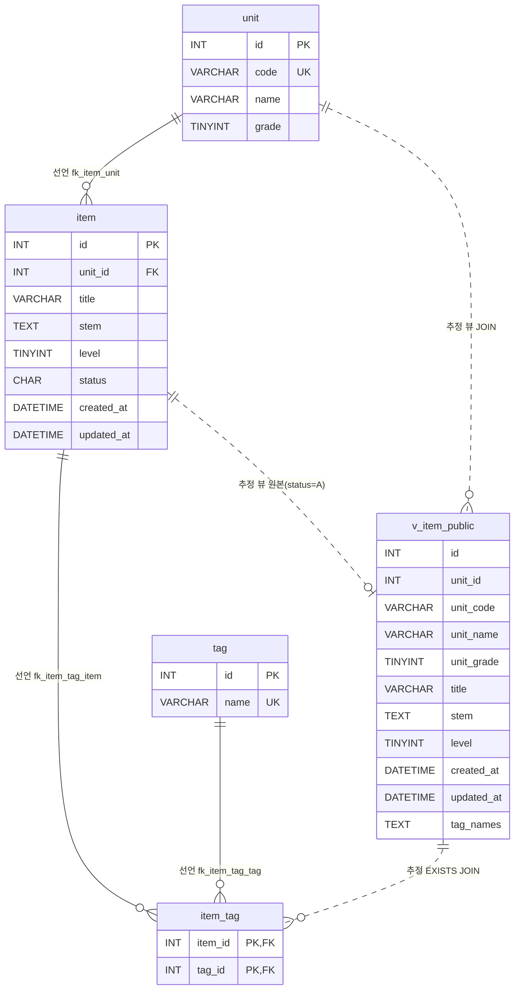

# 문항 은행 (legacy/item-bank-php) 데이터 흐름 · ERD

- 선행 문서: [ARCHITECTURE.md](ARCHITECTURE.md) 의 "DB 객체 참조" 표와 "미확인 목록"을 출발점으로 삼았다.
- 범위: `legacy/item-bank-php/` 가 참조하는 DB 객체만 다룬다. 스키마 근거는 `db/mariadb/init/01-schema.sql`, 시드는 `db/mariadb/init/02-seed.sql` 이다.
- 같은 DB(`itembank`)의 과제 배포 테이블(`class` · `assignment` · `distribution` · `submission`)은 이 모듈이 참조하지 않으므로 제외했다. 단, `assignment.unit_id → unit.id` 외래 키(`01-schema.sql:89`)가 `unit` 을 참조한다는 점만 적어 둔다.
- ARCHITECTURE.md 의 미확인 항목 중 "`v_item_public` 정의"와 "테이블 · 뷰가 실제로 있는지"는 `01-schema.sql` 에서 확인했다(아래 표).

## 1. 테이블 목록

| 테이블 · 뷰 | 주요 컬럼 | 키 · 제약 | 근거 |
|---|---|---|---|
| `unit` | `id` INT, `code` VARCHAR(16), `name` VARCHAR(100), `grade` TINYINT | PK `id`, UNIQUE `code` | `db/mariadb/init/01-schema.sql:11-18` |
| `item` | `id` INT, `unit_id` INT, `title` VARCHAR(200), `stem` TEXT, `level` TINYINT(1~5), `status` CHAR(1) 기본 `'A'` (A=공개 D=삭제 R=검수중), `created_at` DATETIME, `updated_at` DATETIME | PK `id`(AUTO_INCREMENT 아님), FK `unit_id → unit.id`, 인덱스 `unit_id` · `level` | `db/mariadb/init/01-schema.sql:20-33` |
| `tag` | `id` INT, `name` VARCHAR(50) | PK `id`, UNIQUE `name` | `db/mariadb/init/01-schema.sql:35-40` |
| `item_tag` | `item_id` INT, `tag_id` INT | PK (`item_id`, `tag_id`), FK `item_id → item.id`, FK `tag_id → tag.id` | `db/mariadb/init/01-schema.sql:42-48` |
| `v_item_public` (뷰) | `id`, `unit_id`, `unit_code`, `unit_name`, `unit_grade`, `title`, `stem`, `level`, `created_at`, `updated_at`, `tag_names`(태그 이름을 `tag.id` 순으로 쉼표 연결) | `item JOIN unit ON u.id = i.unit_id WHERE i.status = 'A'` | `db/mariadb/init/01-schema.sql:52-70` |

참고:

- `item.id` 는 DB 가 채번하지 않는다. 등록 시 `SELECT COALESCE(MAX(id), 0) + 1 ... FROM item FOR UPDATE` 로 코드가 직접 만든다 (`register.php:87-90`).
- `v_item_public` 은 `status = 'A'` 인 문항만 보여 준다(`01-schema.sql:70`). 등록 코드는 `'R'` 로 넣으므로(`register.php:92-95`) 등록 직후 문항은 검색에 나오지 않는다. 시드의 `R` · `D` 문항이 검색 결과 · 건수에서 빠지는 것은 실행으로 확인했다(2026-09-29, BUSINESS-RULES.md BR-01 · BR-02).
- `unit` 을 포함한 모든 테이블은 `utf8mb4_unicode_ci`(`01-schema.sql:18` 등)라 `unit.code` · 뷰의 `unit_code` 비교는 대소문자를 구분하지 않는다(실행 확인, BUSINESS-RULES.md BR-09).

## 2. 테이블 관계

실선(`--`)은 **선언**(스키마의 FOREIGN KEY), 점선(`..`)은 **추정**(뷰 정의 · 코드의 JOIN 에서 읽어낸 관계, DB 제약 없음)이다.

| 구분 | 관계 | 근거 |
|---|---|---|
| 선언 | `item.unit_id → unit.id` | `01-schema.sql:32` |
| 선언 | `item_tag.item_id → item.id` | `01-schema.sql:46` |
| 선언 | `item_tag.tag_id → tag.id` | `01-schema.sql:47` |
| 추정 | `v_item_public.id = item.id` (공개 문항 1건당 0~1행) | 뷰 정의 `01-schema.sql:54`, `:68-70` |
| 추정 | `v_item_public.unit_id = unit.id` | 뷰 정의 `01-schema.sql:69` |
| 추정 | `item_tag.item_id = v_item_public.id` | 코드 JOIN `search.php:244-245` |

- 코드의 JOIN 중 선언된 FK 와 겹치는 것: `units.php:17` 의 `i.unit_id = u.id`(= `fk_item_unit`), `search.php:244` 의 `t.id = it.tag_id`(= `fk_item_tag_tag`), 뷰 정의 `01-schema.sql:65-67`. 새로 찾은 테이블 간 관계는 없다.

## 3. 읽기 · 쓰기 위치

`units.php`, `register.php` 에는 함수가 없고 파일 최상위 코드에서 SQL 을 실행한다. 이 경우 "(최상위)" 로 적는다.

| 테이블 · 뷰 | 읽기 (SELECT) | 쓰기 (INSERT · UPDATE · DELETE) |
|---|---|---|
| `unit` | `units.php` (최상위) — 단원 목록 + 공개 문항 수 `units.php:16-20` `register.php` (최상위) — 선택 목록 `register.php:27` `search.php` `buildSearchQuery` — 코드로 단원명 조회 `search.php:125`, 선택 목록 `search.php:156` | 없음 |
| `item` | `units.php` (최상위) — `status = 'A'` 건수 서브쿼리 `units.php:17` `register.php` (최상위) — 다음 ID 채번 `MAX(id) ... FOR UPDATE` `register.php:87` | `register.php` (최상위) — INSERT (`status='R'`, `created_at` · `updated_at` = `NOW()`) `register.php:92-101`. UPDATE · DELETE 없음 |
| `tag` | `register.php` (최상위) — 선택 목록 `register.php:34` `search.php` `buildSearchQuery` — 선택 목록 `search.php:178`, 태그 조건 EXISTS 서브쿼리 `search.php:244-245` | 없음 |
| `item_tag` | `search.php` `buildSearchQuery` — 태그 조건 EXISTS 서브쿼리(SQL 조립) `search.php:244-245`, 실행은 `runSearchQuery` `search.php:577`, `:600` | `register.php` (최상위) — INSERT `register.php:104-113`. UPDATE · DELETE 없음 |
| `v_item_public` (뷰) | `search.php` `buildSearchQuery` — 목록 · 건수 SQL 조립 `search.php:521-526` `search.php` `runSearchQuery` — 건수 조회 `search.php:577`, 페이지 조회 `search.php:600` | 해당 없음(뷰) |

- `register.php` 의 `item` · `item_tag` 쓰기는 한 트랜잭션이다: `begin_transaction` `register.php:85`, `commit` `:114`, 실패 시 `rollback` `:120`.
- `search.php` 가 뷰에서 쓰는 컬럼: SELECT `id, title, unit_code, level, tag_names, created_at` (`:521`), WHERE `title` · `stem` (`:98`), `unit_code` (`:118`), `level` (`:215`, `:218`, `:226`), ORDER BY `id` · `title` · `unit_code` · `level` · `created_at` (`:279-325`).
- 이 모듈에서 `unit` · `tag` 에 쓰는 코드는 없다. 두 테이블의 행은 시드(`02-seed.sql:9`, `:19`)로만 들어온다.

## 4. 미확인

| 항목 | 현재 알고 있는 것 | 확인할 곳 |
|---|---|---|
| `item.status` 를 `R → A`(검수 완료), `→ D`(삭제)로 바꾸는 코드 | 이 모듈에 `UPDATE` · `DELETE` 문이 없다. 등록은 `'R'` 로만 넣는다(`register.php:94`) | 다른 모듈 · 운영 스크립트 · 수동 SQL. 모듈 밖이라 확인하지 않음 |
| `status` 에 `A` · `D` · `R` 외의 값이 있는지 | 스키마 주석(`01-schema.sql:26`)에만 세 값이 적혀 있고 CHECK 제약은 없다. **시드 상태**에서는 `A` 26 · `D` 2 · `R` 2 뿐임을 `readonly` 로 확인했다(2026-09-29) | 운영 데이터(시드 밖). CHECK 제약이 없으므로 운영 DB 는 따로 확인 필요 |
| 등록 화면이 `v_item_public` 을 기준으로 삼는지 | 뷰 주석(`01-schema.sql:51`)은 "등록 화면도 이 뷰를 기준으로 삼는다"고 하지만 `register.php` 에는 뷰 참조가 없다 | 주석이 낡은 것인지 설계 의도인지 확인 필요 |
| `item.updated_at` · 뷰의 `unit_name` · `unit_grade` · `updated_at` 을 읽는 곳 | 이 모듈에서는 읽지 않는다(`search.php:521` 에 없음) | 다른 모듈 |
| `item_tag` 에서 행이 지워지거나 바뀌는 경로 | 이 모듈에는 없다 | 다른 모듈 |
| 동시 등록 시 `MAX(id)+1` 채번의 충돌 여부 | `FOR UPDATE` 를 쓰지만 실제 잠금 범위는 실행해 보지 않았다 | MariaDB 에서 동시 요청으로 검증 |
